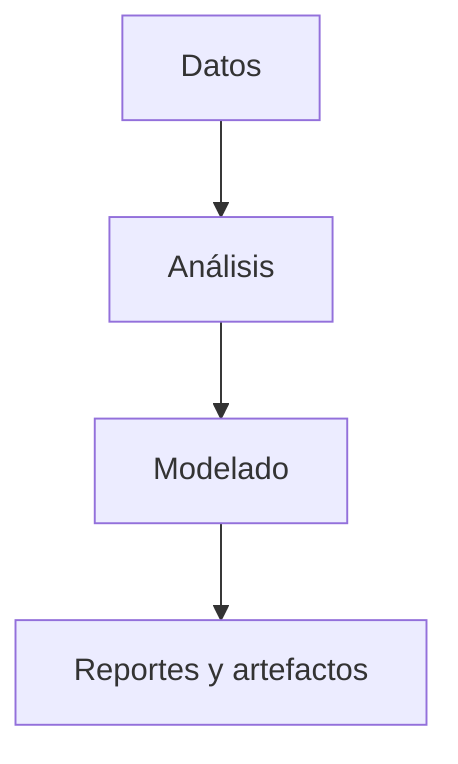

# Proyectos Educativos

Esta sección reúne proyectos relacionados con retos pedagógicos y aplicaciones guiadas para aprender ciencia de datos..

## Objetivo

Organizar el flujo de trabajo desde los datos hasta los resultados para que cada proyecto sea fácil de revisar y extender.

## Proyectos incluidos

- [Proyecto_1](Proyecto_1)
- [Proyecto_2](Proyecto_2)
- [Proyecto_3](Proyecto_3)
- [Proyecto_4](Proyecto_4)
- [Proyecto_5](Proyecto_5)

## Estructura típica

- [data/](./data) o subcarpetas con datos locales
- [notebooks/](./notebooks), [notebook/](./notebook) o [src/](./src) para análisis y scripts
- [models/](./models) para artefactos entrenados
- [documents/](./documents), [docs/](./docs) o [html/](./html) para reportes y visualizaciones

## Flujo recomendado

## Enlaces relacionados

- [Portafolio principal](../README.md)
