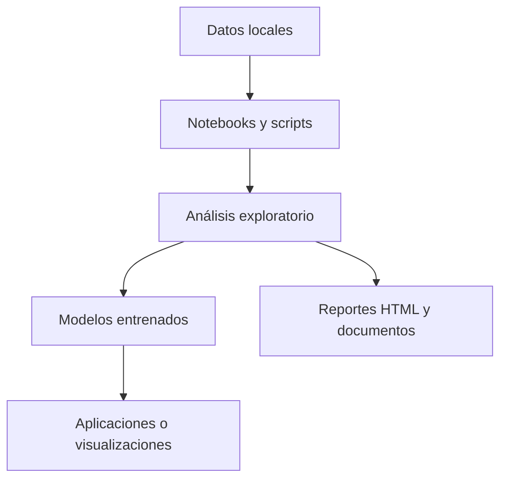

# Portafolio de Ciencia de Datos y Aprendizaje Autónomo

Este repositorio organiza un portafolio práctico de proyectos de ciencia de datos, desde visualización y limpieza hasta modelado, análisis avanzado y soluciones aplicadas al mundo real.

## Mapa general del flujo

## Secciones del repositorio

| Sección | Enfoque | Enlace |
| --- | --- | --- |
| Visualización de Datos | Storytelling visual y dashboards | [01-Visualización_de_Datos](./01-Visualización_de_Datos) |
| Tratamiento de Datos | Limpieza y preparación de datos | [02-Tratamiento_de_Datos](./02-Tratamiento_de_Datos) |
| Aplicación de Modelos | Modelos predictivos y optimización | [03-Aplicación_de_Modelos](./03-Aplicación_de_Modelos) |
| Análisis Avanzado | NLP, series temporales y clustering | [04-Analisis_Avanzado](./04-Analisis_Avanzado) |
| Proyectos Educativos | Ejercicios prácticos y aprendizaje guiado | [05-Proyectos_Educativos](./05-Proyectos_Educativos) |
| Integración con el Mundo Real | Proyectos aplicados y reproducibles | [06-Integración_con_el_Mundo_Real](./06-Integración_con_el_Mundo_Real) |

## Cómo navegar el repositorio

1. Elige la sección que más te interese.
2. Abre notebooks o scripts para revisar el flujo completo.
3. Revisa los datos, resultados y artefactos generados.
4. Usa los proyectos educativos como base antes de pasar a los más aplicados.

## Enlaces recomendados

- [Proyecto 5 de Integración](./06-Integración_con_el_Mundo_Real/Proyecto_5)
- [Proyecto 5 Educativo](./05-Proyectos_Educativos/Proyecto_5)
- [Proyecto 5 de Visualización](./01-Visualización_de_Datos/Proyecto_5)

## Descripción general por unidades y proyectos

Este portafolio está organizado en seis unidades que representan un recorrido progresivo en ciencia de datos, desde la visualización inicial hasta la aplicación de soluciones reales.

### 1. Visualización de Datos
Esta unidad se enfoca en comunicar hallazgos mediante gráficos, dashboards y narrativas visuales. Los proyectos abordan temas como cambios climáticos, movilidad urbana, evolución de la pandemia en Latinoamérica, desigualdad de género y desempeño deportivo en competencias de triatlón.

- [Proyecto 1: análisis interactivo de temperaturas globales y tendencias climáticas](./01-Visualización_de_Datos/Proyecto_1)
- [Proyecto 2: estudio de tráfico urbano y patrones de congestión](./01-Visualización_de_Datos/Proyecto_2)
- [Proyecto 3: construcción de una narrativa visual sobre la pandemia de COVID-19 en LATAM](./01-Visualización_de_Datos/Proyecto_3)
- [Proyecto 4: visualización de brechas de género en educación, empleo e ingresos](./01-Visualización_de_Datos/Proyecto_4)
- [Proyecto 5: exploración visual del rendimiento de atletas Ironman](./01-Visualización_de_Datos/Proyecto_5)

### 2. Tratamiento de Datos
Esta unidad está orientada a la limpieza, preparación y transformación de datos para que puedan usarse de forma confiable en análisis y modelado. Los proyectos incluyen procesamiento financiero, calidad del aire, extracción de texto, detección de anomalías en señales biomédicas y análisis de texto.

- [Proyecto 1: preparación automatizada de datos financieros para series temporales](./02-Tratamiento_de_Datos/Proyecto_1)
- [Proyecto 2: limpieza y normalización de datos ambientales de calidad del aire](./02-Tratamiento_de_Datos/Proyecto_2)
- [Proyecto 3: extracción y organización de texto a partir de imágenes mediante OCR](./02-Tratamiento_de_Datos/Proyecto_3)
- [Proyecto 4: tratamiento de señales ECG para detectar anomalías](./02-Tratamiento_de_Datos/Proyecto_4)
- [Proyecto 5: preprocesamiento de datos textuales para tareas de NLP](./02-Tratamiento_de_Datos/Proyecto_5)

### 3. Aplicación de Modelos
Esta unidad concentra el trabajo con modelos predictivos, optimización y aprendizaje automático aplicado a problemas concretos. Incluye tareas de clasificación, recomendación, regresión, optimización de rutas y reconocimiento visual.

- [Proyecto 1: predicción de enfermedades mediante datos clínicos y modelos supervisados](./03-Aplicación_de_Modelos/Proyecto_1)
- [Proyecto 2: optimización de rutas de transporte con enfoque logístico](./03-Aplicación_de_Modelos/Proyecto_2)
- [Proyecto 3: implementación de sistemas de recomendación personalizados](./03-Aplicación_de_Modelos/Proyecto_3)
- [Proyecto 4: estimación de precios de vivienda con modelos de regresión](./03-Aplicación_de_Modelos/Proyecto_4)
- [Proyecto 5: clasificación automática de residuos mediante visión por computadora](./03-Aplicación_de_Modelos/Proyecto_5)

### 4. Análisis Avanzado
Esta unidad profundiza en técnicas más sofisticadas para descubrir patrones complejos, pronosticar comportamientos y segmentar datos. Se trabaja con series temporales, análisis de texto, clustering y modelos de alto rendimiento.

- [Proyecto 1: estudio del engagement en redes sociales y predicción de rendimiento](./04-Analisis_Avanzado/Proyecto_1)
- [Proyecto 2: análisis de consumo energético y detección de patrones temporales](./04-Analisis_Avanzado/Proyecto_2)
- [Proyecto 3: forecasting financiero con series temporales y retardos](./04-Analisis_Avanzado/Proyecto_3)
- [Proyecto 4: procesamiento de documentos jurídicos y extracción de información](./04-Analisis_Avanzado/Proyecto_4)
- [Proyecto 5: segmentación de clientes mediante clustering avanzado](./04-Analisis_Avanzado/Proyecto_5)

### 5. Proyectos Educativos
Esta unidad está diseñada para fortalecer habilidades de forma práctica mediante retos, ejercicios guiados y aplicaciones sencillas que permiten aprender ciencia de datos paso a paso.

- [Proyecto 1: simulación del comportamiento de una pandemia con modelos SIR](./05-Proyectos_Educativos/Proyecto_1)
- [Proyecto 2: limpieza y corrección de datos ruidosos para convertirlos en datasets útiles](./05-Proyectos_Educativos/Proyecto_2)
- [Proyecto 3: visualización y explicación de resultados de modelos de machine learning](./05-Proyectos_Educativos/Proyecto_3)
- [Proyecto 4: uso de técnicas de explicabilidad como SHAP y LIME para interpretar modelos](./05-Proyectos_Educativos/Proyecto_4)
- [Proyecto 5: resolución de una competencia de clasificación inspirada en Spaceship Titanic](./05-Proyectos_Educativos/Proyecto_5)

### 6. Integración con el Mundo Real
Esta unidad conecta los conocimientos adquiridos con problemas reales y aplicaciones reproducibles, con foco en análisis, modelado y entrega de resultados útiles en contextos de toma de decisiones.

- [Proyecto 1: detección de fraude financiero mediante análisis de transacciones](./06-Integración_con_el_Mundo_Real/Proyecto_1)
- [Proyecto 2: pronóstico del clima local con enfoque de series temporales y variables ambientales](./06-Integración_con_el_Mundo_Real/Proyecto_2)
- [Proyecto 3: análisis de impacto ambiental y evaluación de calidad del aire](./06-Integración_con_el_Mundo_Real/Proyecto_3)
- [Proyecto 4: optimización de cultivos y predicción de rendimiento agrícola](./06-Integración_con_el_Mundo_Real/Proyecto_4)
- [Proyecto 5: monitorización de transporte público y análisis de retrasos y movilidad](./06-Integración_con_el_Mundo_Real/Proyecto_5)

Esta estructura permite recorrer el repositorio de forma progresiva: primero desde la exploración y visualización, luego por la preparación de datos, el modelado, el análisis avanzado y finalmente la aplicación a problemas del mundo real.
