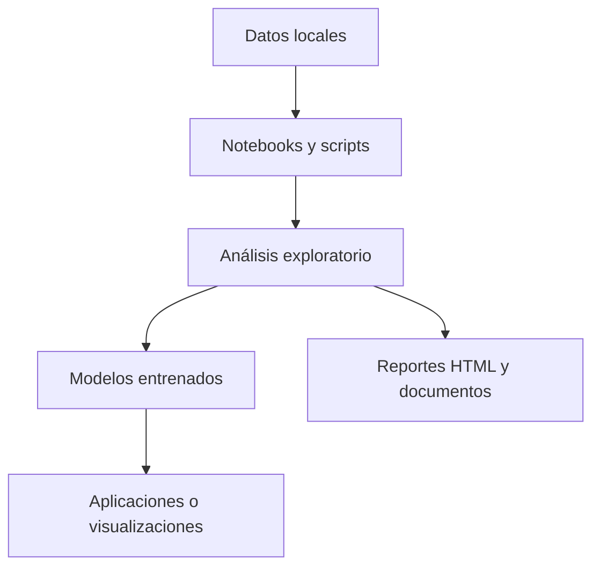

# Portafolio de Ciencia de Datos y Aprendizaje Autónomo

Este repositorio organiza un portafolio práctico de proyectos de ciencia de datos, desde visualización y limpieza hasta modelado, análisis avanzado y soluciones aplicadas al mundo real.

## Mapa general del flujo

## Secciones del repositorio

| Sección | Enfoque | Enlace |
| --- | --- | --- |
| Visualización de Datos | Storytelling visual y dashboards | [01-Visualización_de_Datos](./01-Visualización_de_Datos) |
| Tratamiento de Datos | Limpieza y preparación de datos | [02-Tratamiento_de_Datos](./02-Tratamiento_de_Datos) |
| Aplicación de Modelos | Modelos predictivos y optimización | [03-Aplicación_de_Modelos](./03-Aplicación_de_Modelos) |
| Análisis Avanzado | NLP, series temporales y clustering | [04-Analisis_Avanzado](./04-Analisis_Avanzado) |
| Proyectos Educativos | Ejercicios prácticos y aprendizaje guiado | [05-Proyectos_Educativos](./05-Proyectos_Educativos) |
| Integración con el Mundo Real | Proyectos aplicados y reproducibles | [06-Integración_con_el_Mundo_Real](./06-Integración_con_el_Mundo_Real) |

## Cómo navegar el repositorio

1. Elige la sección que más te interese.
2. Abre notebooks o scripts para revisar el flujo completo.
3. Revisa los datos, resultados y artefactos generados.
4. Usa los proyectos educativos como base antes de pasar a los más aplicados.

## Enlaces recomendados

- [Proyecto 5 de Integración](./06-Integración_con_el_Mundo_Real/Proyecto_5)
- [Proyecto 5 Educativo](./05-Proyectos_Educativos/Proyecto_5)
- [Proyecto 5 de Visualización](./01-Visualización_de_Datos/Proyecto_5)
