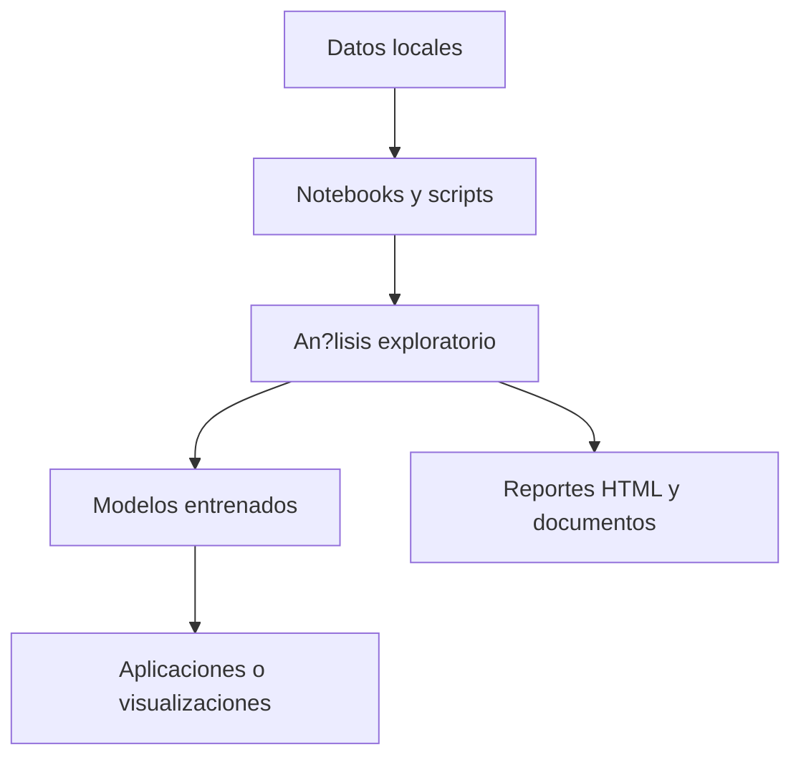

# Portafolio de Ciencia de Datos y Aprendizaje Aut?nomo

Este repositorio organiza un portafolio pr?ctico de proyectos de ciencia de datos, desde visualizaci?n y limpieza hasta modelado, an?lisis avanzado y soluciones aplicadas al mundo real.

## Mapa general del flujo

## Secciones del repositorio

| Secci?n | Enfoque | Enlace |
| --- | --- | --- |
| Visualizaci?n de Datos | Storytelling visual y dashboards | [01-Visualizaci?n_de_Datos](./01-Visualizaci?n_de_Datos) |
| Tratamiento de Datos | Limpieza y preparaci?n de datos | [02-Tratamiento_de_Datos](./02-Tratamiento_de_Datos) |
| Aplicaci?n de Modelos | Modelos predictivos y optimizaci?n | [03-Aplicaci?n_de_Modelos](./03-Aplicaci?n_de_Modelos) |
| An?lisis Avanzado | NLP, series temporales y clustering | [04-Analisis_Avanzado](./04-Analisis_Avanzado) |
| Proyectos Educativos | Ejercicios pr?cticos y aprendizaje guiado | [05-Proyectos_Educativos](./05-Proyectos_Educativos) |
| Integraci?n con el Mundo Real | Proyectos aplicados y reproducibles | [06-Integraci?n_con_el_Mundo_Real](./06-Integraci?n_con_el_Mundo_Real) |

## C?mo navegar el repositorio

1. Elige la secci?n que m?s te interese.
2. Abre notebooks o scripts para revisar el flujo completo.
3. Revisa los datos, resultados y artefactos generados.
4. Usa los proyectos educativos como base antes de pasar a los m?s aplicados.

## Enlaces recomendados

- [Proyecto 5 de Integraci?n](./06-Integraci?n_con_el_Mundo_Real/Proyecto_5)
- [Proyecto 5 Educativo](./05-Proyectos_Educativos/Proyecto_5)
- [Proyecto 5 de Visualizaci?n](./01-Visualizaci?n_de_Datos/Proyecto_5)
